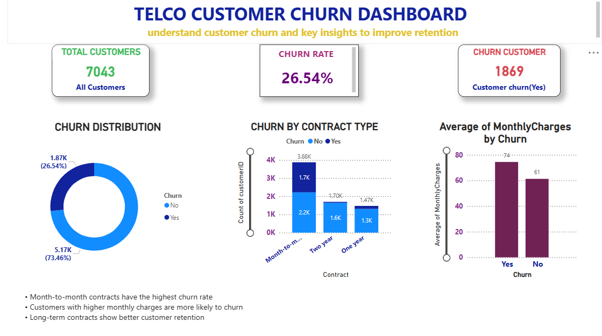

# 📊 Telco Customer Churn Analysis

End-to-end data analytics project to analyze customer churn using **Python, SQL, and Power BI**.  
This project follows a complete workflow from raw data → database → analysis → machine learning → dashboard.

---

## 🎯 Objective
To analyze customer behavior and identify factors that lead to customer churn, and build a predictive model.

---

## 📂 Dataset
- Telco Customer Churn Dataset
- Contains customer demographics, services, tenure, charges, and churn status

---

## 🛠 Tools & Technologies
- Python (Pandas, NumPy, Scikit-learn)
- SQL (Data storage & querying)
- Power BI (Dashboard & visualization)
- Jupyter Notebook

---

## 🔄 Project Workflow

### 1️⃣ Data Processing
- Loaded CSV dataset
- Cleaned missing values
- Converted `TotalCharges` to numeric
- Encoded `Churn` column (Yes → 1, No → 0)

---

### 2️⃣ SQL Analysis
- Stored data in SQLite database
- Performed queries like:
  - Total customers
  - Churn count
  - Average monthly charges
  - Customer segmentation

---

### 3️⃣ Machine Learning
- Applied Logistic Regression model
- Train-test split
- Evaluated performance

**Accuracy: ~79%**

---

### 4️⃣ Power BI Dashboard
- Created interactive dashboard
- Visualized:
  - Total Customers vs Churned Customers
  - Churn Rate %
  - Monthly Charges impact
  - Tenure analysis

---

## 📊 Dashboard Preview

---

## 🔥 Key Insights
- Customers with low tenure are more likely to churn
- Higher monthly charges increase churn probability
- Fiber optic users show higher churn rate

---

## 🚀 Project Outcome
Built a complete end-to-end data analytics pipeline:
**CSV → SQL → Python ML → Power BI Dashboard**

---

## 👨‍💻 Author
Aspiring Data Analyst | Python • SQL • Power BI • Machine Learning
